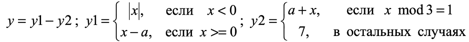

# Лабораторная работа №2 
**В соответствии с вариантом напишите программу на языке ассемблера. 
Переменная a задается в программе и не меняется в процессе ее исполнения. 
Переменная x изменяется в диапазоне от 0 до 15. Результат вывести на экран 
ответ в 10-чном и 16-чном виде**

