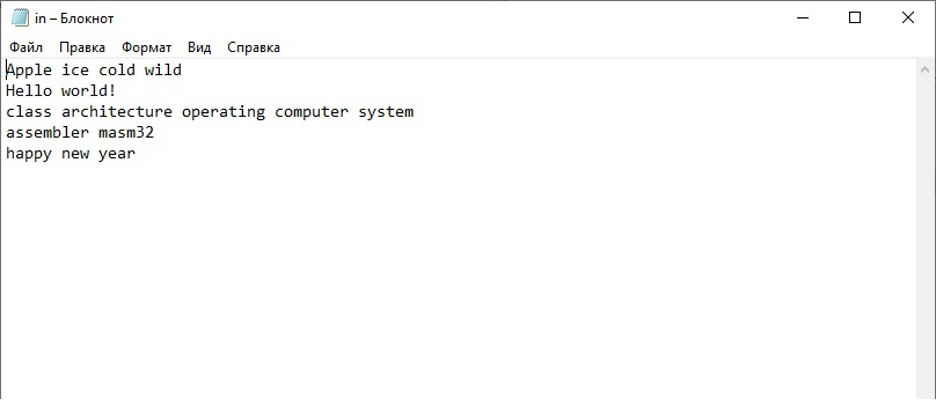
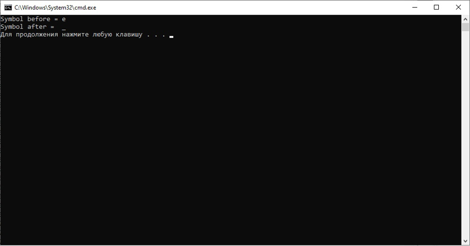
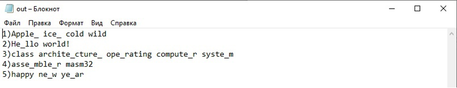

# Лабораторная работа №4
**Имеется два файла.
Необходимо прочитать информацию из первого файла, обработать ее в соответствии с вариантом задания. Результат необходимо сохранить во второй файл.
При работе необходимо использовать команды Assembler для работы массивами строковых данных (цепочные команды: LODS, STOS, MOVS, CMPS). Для работы с файлами необходимо использовать API-функции Windows (CreateFileA, GetFileSize, SetFilePointer, WriteFile, ReadFile, CloseHandle).**

**Задание по варианту:** 
**Вставить в каждое слово каждой строки после заданного символа символ, введенный пользователем.**

## Результат:
*Входной файл* 

*Результат запуска программы* 

*Файл после запуска программы* 

