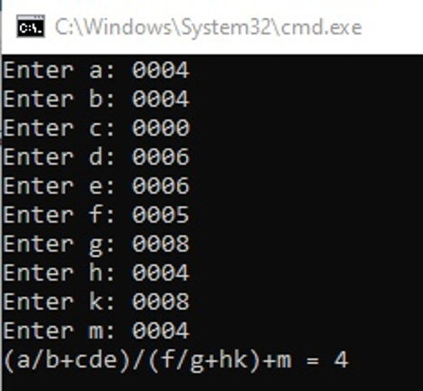

# Лабораторная работа №5

**Дано число в двоичном виде. Логически перемножить его с числом 28. Проинвертировать результат и умножить на 4. В полученном значении 4,5,6 разряды заменить на противоположные.**

**Задание по варианту:** 
**(a/b+cde)/(f/g + hk) + m**

## Результат:
*Введения нуля в знаменатель* 

*Нажатие Enter не закончив ввод* 

*Результат* 

